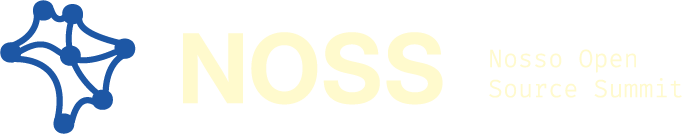

<div align="center">
  <picture>
    <source
      media="(prefers-color-scheme: dark)"
      srcset="brand/materiais/identidade-visual/logo/ativo-40.png"
    >
    <source
      media="(prefers-color-scheme: light)"
      srcset="brand/materiais/identidade-visual/logo/ativo-29.png"
    >
    
  </picture>

Brazil is already building open source. Now it's time to create and strengthen the connections.

<div>

### [NOSS 2026](./README_EN.md) - May 30 - Online Event - [Youtube/@CumbucaDev](https://www.youtube.com/watch?v=2GLyGSolizQ)

</div>

[Versão em português](README.md)

<div align='left'>

## 📚 Table of Contents

- [About](#-about)
- [Sustainability as a Core Pillar](#-sustainability-as-a-core-pillar)
- [Brazil in This Context](#-brazil-in-this-context)
- [Sovereignty and the Capacity to Build](#-sovereignty-and-the-capacity-to-build)
- [Origins and Continuity](#-origins-and-continuity)
- [Why May](#why-may)
- [What We're Building](#-what-were-building)
- [FLOSS Is Also About Making a Living](#-floss-is-also-about-making-a-living)
- [References](#-references)
- [Diversity and Access](#-diversity-and-access)
- [Open Structure](#-open-structure)
- [Repository Structure](#-repository-structure)
- [Sustainability](#-sustainability)
- [Why NOSS](#-why-noss)
- [Contact](#-contact)
- [Contributing](#-contributing)
- [Discussions](#-discussions)
- [Contributors](#%EF%B8%8F-contributors)

---

## 🧾 About

NOSS was born from a shared frustration—one that walks alongside a dream.

We live in a world powered by open technologies. Yet the people who maintain this ecosystem often remain invisible, overburdened, and disconnected from one another.

In Brazil, this reality is even more evident.

Many talented people are building meaningful projects, contributing to global communities, and creating solutions that make a real impact. Yet they often lack visibility, collaboration opportunities, and sustainable ways to be recognized and rewarded for their work.

NOSS exists to bring these people together. Not just as an event, but as a space for connection.

---

## 🌱 Sustainability as a Core Pillar

Discussions about open source are still largely centered around the idea of contribution. While contribution is essential, it is not enough.

Without sustainability, projects cannot endure. Without maintenance, there is no continuity. And without continuity, there is no ecosystem.

Talking about [FLOSS](https://flusp.ime.usp.br/floss/) in Brazil requires explicitly addressing issues such as income, funding, value distribution, and the real conditions that enable people to continue contributing. These should not be treated as exceptions, but as fundamental parts of the model.

This is especially important in contexts where structural inequalities directly affect who is able to enter, remain in, and grow within the open source ecosystem.

---

## 🇧🇷 Brazil in This Context

Brazil is already a significant contributor to the global open source ecosystem. Public data, including GitHub's Octoverse reports and GitHub Research, shows consistent growth in the Brazilian developer community, both in the number of contributors and in overall contributions.

However, this level of participation has not translated into an equivalent ability to capture value.

There is still a clear gap between contributing and building sustainable structures, between participating and leading, and between creating technology and transforming that work into income, long-term sustainability, and influence.

In practice, this pattern is common: people join the ecosystem but struggle to find the conditions needed to remain in it sustainably. And when they do, those opportunities are often found outside Brazil.

**References**

- [GitHub Octoverse](https://octoverse.github.com/)
- [GitHub Research](https://github.blog/news-insights/research/)
- [Stack Overflow Developer Survey](https://survey.stackoverflow.co/)

The challenge is not technical capability. It is connection, visibility, and access.

---

## 👑 Sovereignty and the Capacity to Build

Discussions about technological sovereignty are often reduced to infrastructure or the ability to consume technology. In reality, they also involve the ability to maintain, evolve, and sustain technologies over time.

A country that only consumes technology remains dependent. A country that contributes but fails to build sustainable structures remains dependent as well.

Strengthening Brazil's open source ecosystem means creating the conditions for people and projects to grow locally—with continuity, recognition, and long-term opportunities. Achieving this requires organization, collaboration, and a strong network of people working together.

---

## 🌳 Origins and Continuity

Cumbuca Dev has long been creating pathways into technology, with a strong focus on accessibility, education, and community.

In practice, this means working closely with people who are just beginning their journey and witnessing the challenges that often interrupt that path. One pattern appears consistently: getting started is possible, but staying and growing is far from guaranteed.

NOSS is a natural continuation of this work, expanding its focus to another layer of the ecosystem: collaboration, visibility, and sustainability within open source.

Rather than starting something entirely new, NOSS seeks to organize and strengthen what already exists—bringing together a community that has long been active, but too often remains fragmented.

---

<h2 id="why-may">🗓️ Why May</h2>

May is internationally recognized as **Maintainer Month**, a time dedicated to celebrating and supporting the people who keep open source projects alive.

- [GitHub](https://maintainermonth.github.com/)
- [Open Source Initiative (OSI)](https://opensource.org/blog/may-is-maintainer-month-celebrating-those-who-secure-open-source)

Maintainers are the people who sustain the ecosystem every day. Yet they often do so with limited visibility, recognition, and resources.

In Brazil, these challenges are compounded by additional barriers:

- Less funding
- Lower international visibility
- Greater reliance on volunteer work

Choosing May is an intentional decision. It reflects our commitment to putting the spotlight on the people who make open source possible.

---

## 🚀 What We're Building

NOSS is the first step toward creating a meeting point for the FLOSS ecosystem in Brazil.

A space to:

- Bring people and communities closer together
- Give visibility to projects and maintainers
- Share real-world technical experiences
- Support people who are just getting started
- Strengthen those who are already building

---

## 💰 FLOSS Is Also About Making a Living

Open source is often associated with:

- Building a portfolio
- Learning
- Voluntary contributions — usually after reaching a certain career stage

But it goes far beyond that...

FLOSS can also be:

- A source of income
- A professional opportunity
- A way to build reputation
- A real possibility of building a life with code and purpose

Contributing is important.

Supporting those who contribute is essential.

---

## 🌍 References

NOSS is inspired by and connected to established initiatives within the global ecosystem:

- All Things Open  
  https://allthingsopen.org/

- Open Source Initiative  
  https://opensource.org/

- Linux Foundation  
  https://www.linuxfoundation.org/

- Python Software Foundation  
  https://www.python.org/psf/

---

## 🌱 Diversity and Access

Talking about open source in Brazil also means talking about who is able to enter and remain in the ecosystem.

And we know that access is not equal for everyone.

That is why NOSS carries the same commitment that Cumbuca Dev has been building:

- Expand access
- Give visibility to diverse journeys and experiences
- Reduce real barriers
- Build a safe space for everyone

---

## 🔓 Open Structure

This project is open.

This means:

- Public documentation
- Collaborative building
- The ability to replicate and adapt

Any person or community can adapt this model and create new editions.

---

## 🧩 Repository Structure

```
/docs   → structural documents
/docs/edicoes/2026   → current edition
/brand  → visual identity
```

👉 Details about the current edition:  
[./docs/edicoes/2026/en.md](./docs/edicoes/2026/en.md)

---

## 💰 Sustainability

The event is free.

The resources raised are used for:

- Event execution
- Technical quality
- Community strengthening
- Continuity of initiatives
- Support for communities within the ecosystem

There is no individual profit distribution.

---

## 🪢 Why NOSS

The name is not just an aesthetic choice.

“NOSS” carries two complementary layers of meaning.

The first one is straightforward: **Nosso Open Source Summit**. A space that does not belong to a single organization, but is built collectively by different people, communities, and initiatives — a space that represents and belongs to everyone, and that brings us together by creating connections — by creating nodes.

The second one is structural: **nodes**.

Not only as a metaphor, but as a fundamental condition for the existence of any ecosystem. Open source is not sustained by code alone. It is sustained by relationships, continuity, and collaboration among those who build, maintain, learn from, and depend on this infrastructure.

The challenge we face today is not a lack of technology. It is the lack of structured connections.

NOSS exists to organize these nodes.

To bring together people who currently operate in isolation.  
To give visibility to those who maintain.  
To connect contribution with opportunity.  
To transform participation into sustainability.

This movement does not start here.

It is already happening in practice, within communities and projects that create pathways for learning and entering the ecosystem. NOSS organizes the next step: building continuity, collaboration, and sustainability.

If open source sustains the world, NOSS starts from a simple premise: the Brazilian ecosystem also needs to sustain itself.

And that only happens when there is a network.

When there are connections.

When there are nodes.

---

<div align="center">

Created and organized with 💜 by [Cumbuca Dev](https://cumbuca.dev)

</div>

## 📌 Contact

[eventos@cumbuca.dev](mailto:eventos@cumbuca.dev)

---

## 💻 Contributing

Read:

- [CONTRIBUTING_EN.md](CONTRIBUTING_EN.md)
- [CODE_OF_CONDUCT_EN.md](/CODE_OF_CONDUCT_EN.md)
- [VISION_EN.md](/VISION_EN.md)

---

## 💬 Discussions

https://github.com/cumbucadev/NOSS/discussions

---

## ❤️ Contributors

<a href="https://github.com/cumbucadev/NOSS/graphs/contributors">
  
</a>

---