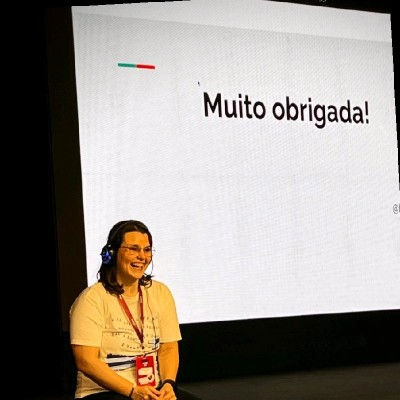

# Belisa Arnhold

## 📌 Informações

- **Pronomes:** ela/dela - she/her
- **LinkedIn:** https://www.linkedin.com/in/belisarenata/
- **GitHub:** https://github.com/belisarenata

## 🧠 Bio

Backend Software Engineer (4+ years) with a strong focus on Python and data-oriented systems. Experienced in both large-scale environments and early-stage startups, building maintainable, reliable backend solutions that support growing products.

Actively engaged in the Brazilian Python community through events and initiatives that promote technical exchange and collaboration.

Tech stack includes Python, modern Python web frameworks (FastAPI, Django), ETL/ELT workflows, microservices, and cloud-native development (aws/gcp).

## 🎤 Atividades

- Apresente seu projeto!
