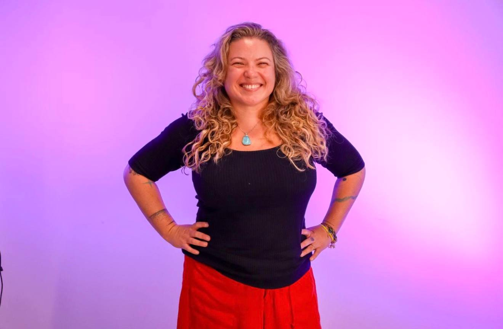

# Carla Rocha

## 📌 Informações

- **Pronomes:** ela/dela - she/her
- **LinkedIn:** https://www.linkedin.com/in/carla-rocha-a4287a19/
- **GitHub:** https://github.com/RochaCarla

## 🧠 Bio

Sou professora no curso de Engenharia de Software na Universidade de Brasília (UnB). Tenho mais de 10 anos de experiência prática e acadêmica com desenvolvimento de software, DevOps, MLOps, engenharia de dados e plataformas digitais, com interesse particular em software livre, impacto social e inovação no setor público. Coordeno o Lab Livre – Laboratório de Competência em Software Livre, onde lidero projetos de pesquisa, desenvolvimento e inovação. Tenho ampla experiência em parcerias com órgãos governamentais, e formação de estudantes através de projetos práticos e colaborativos. Co-fundei o programa de mentoria BOSS, para fazer o onboarding de pessoas de grupos subrepresentados em comunidades de software livre, programa premiado pela Gnome Community Engagement Challenge.

## 🎤 Atividades

- [Tecnologias abertas para políticas públicas](../atividades/tecnologias-abertas-para-politicas-publicas.md)
