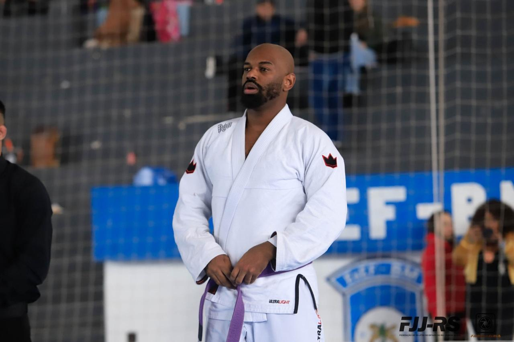

# FeliPython

## 📌 Informações

- **Pronomes:** ele/dele - he/him
- **LinkedIn:** https://www.linkedin.com/in/felipythondev/
- **GitHub:** https://github.com/felipythondev/

## 🧠 Bio

🎉 FeliPython aqui! Premiado com PSF Fellow 🏅, Community Service Award 🏆 e Dorneles Treméa 🏵️.

## 🎤 Atividades

- [Como contribuir open source mudou a minha vida](../atividades/como-contribuir-open-source-mudou-a-minha-vida.md)
