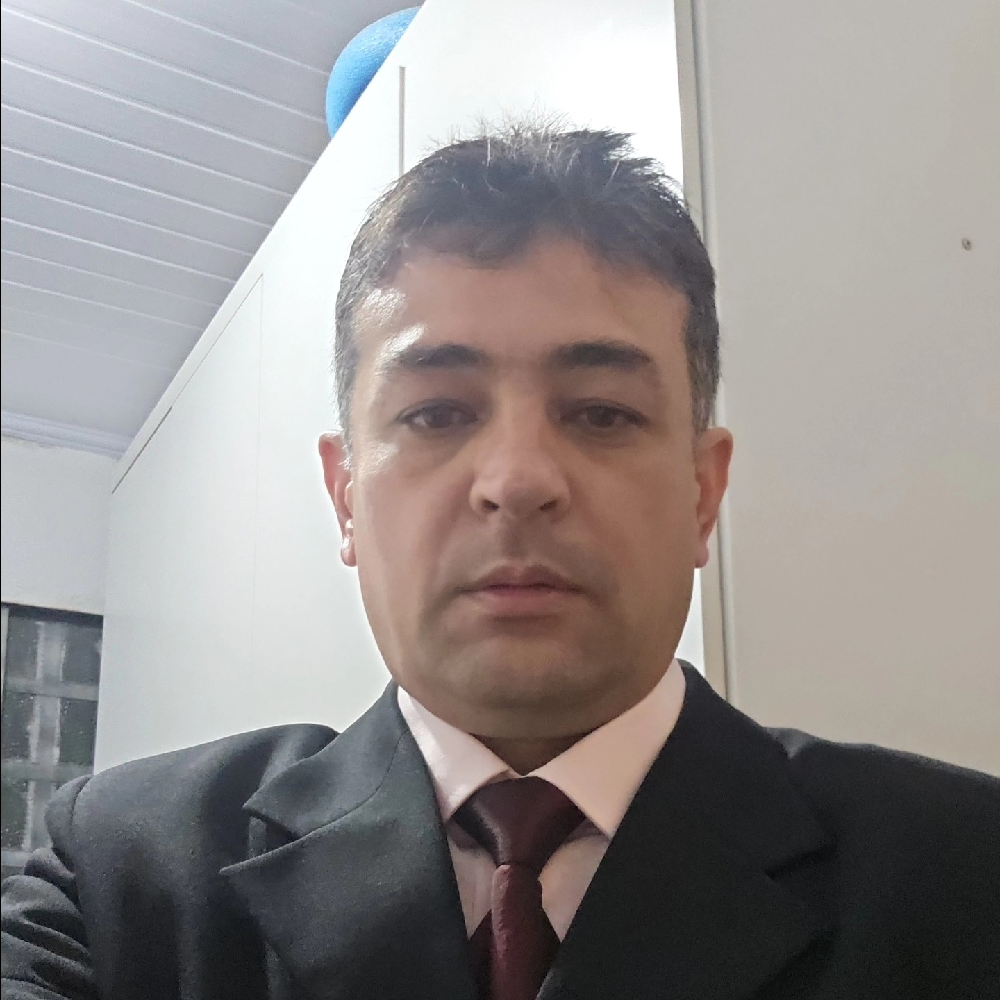

# Henderson Matsuura Sanches

## 📌 Informações

- **Pronomes:** ele/dele - he/him
- **LinkedIn:** https://www.linkedin.com/in/henderson-matsuura-sanches-89644623/
- **GitHub:** -

## 🧠 Bio

Sou um profissional de tecnologia da informação com mais de 10 anos de experiência em Análise de Requisitos, gerenciamento de redes e gestão de projetos. Atualmente, sou professor e coordenador de curso de TI no Centro Universitário Processus – UniProcessus, Professor na Faculdade Brasília (FBr), Membro da The Document Foundation (TDF), Membro da Comunidade LibreOffice Brasil, com formação em Mestrado em Engenharia Biomédica pela Universidade de Brasília, Pós-graduação em Engenharia DevOps pela Faculdade Focus, Michelangelo e Licenciatura em Computação pela Faculdade Fortium, e competências em gestão de projetos, design instrucional, administração de sistemas, configuração de redes, suporte de software, engenharia biomédica, ontologia, sistema inteligente, software protégé, gestão dos indicadores de qualidade do ensino superior, software livre, software livre educacional e engenharia DevOps.

## 🎤 Atividades

- Apresente seu projeto!
